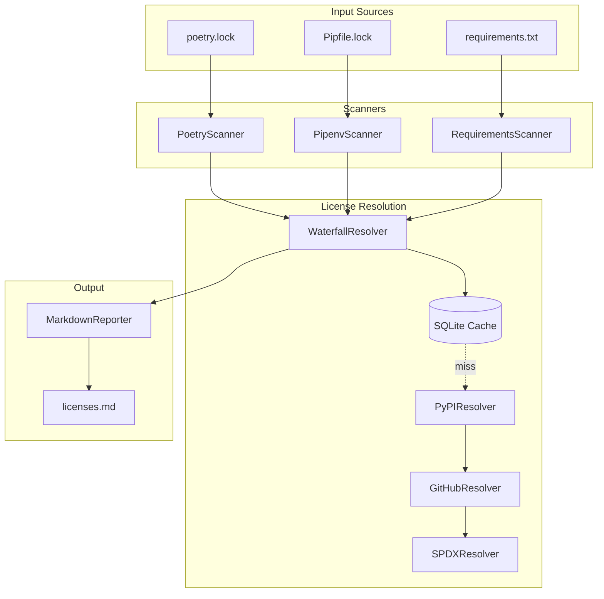

# License Tracker

[](https://opensource.org/licenses/MIT)
[](https://www.python.org/downloads/)
[]()
[]()

**Automated open source license attribution and compliance tool for Python projects.**

License Tracker scans your dependency lock files, resolves license metadata from PyPI and GitHub, and generates hyperlinked attribution documents. It bridges the gap between abstract package metadata and the concrete need for consumer-facing documentation with verified links.

## Features

- **Multiple Input Formats**: Scan `poetry.lock`, `Pipfile.lock`, or `requirements.txt`
- **Smart Resolution**: Waterfall lookup through PyPI → GitHub → SPDX fallback
- **Verified Links**: Direct links to actual LICENSE files on GitHub when available
- **Compliance Checking**: Validate against allow/deny license lists
- **Caching**: SQLite cache with 30-day TTL to minimize API calls
- **Custom Templates**: Jinja2 templates for custom output formats
- **Async Performance**: Concurrent resolution for 100+ dependencies

## Architecture



## Installation

```bash
pip install license-tracker
```

Or install from source:

```bash
git clone https://github.com/forkrul/license_tracker
cd license_tracker
pip install -e .
```

## Quick Start

### Generate License Attribution

```bash
# From poetry.lock
license-tracker gen --scan poetry.lock --output licenses.md

# From Pipfile.lock
license-tracker gen --scan Pipfile.lock

# From requirements.txt
license-tracker gen --scan requirements.txt
```

### Check License Compliance

```bash
# Deny specific licenses
license-tracker check --scan poetry.lock --forbidden "GPL-3.0,AGPL-3.0"

# Allow only specific licenses
license-tracker check --scan poetry.lock --allowed "MIT,Apache-2.0,BSD-3-Clause"
```

### Manage Cache

```bash
# View cache info
license-tracker cache show

# Clear all cached entries
license-tracker cache clear

# Clear specific package
license-tracker cache clear requests
```

## CLI Reference

### `gen` Command

Generate license attribution documentation.

```
license-tracker gen [OPTIONS]

Options:
  -s, --scan PATH         Path to lock file (required)
  -o, --output PATH       Output file [default: licenses.md]
  --include-root          Include root project license
  -t, --template PATH     Custom Jinja2 template
  --github-token TEXT     GitHub API token (or GITHUB_TOKEN env var)
  -v, --verbose           Enable verbose output
```

### `check` Command

Check license compliance against allow/deny lists.

```
license-tracker check [OPTIONS]

Options:
  -s, --scan PATH         Path to lock file (required)
  -f, --forbidden TEXT    Comma-separated forbidden SPDX IDs
  -a, --allowed TEXT      Comma-separated allowed SPDX IDs
  --github-token TEXT     GitHub API token
  -v, --verbose           Enable verbose output

Exit Codes:
  0 - All licenses compliant
  1 - Violations found
  2 - Error occurred
```

### `cache` Command

Manage the license resolution cache.

```
license-tracker cache <action> [package]

Actions:
  show   - Display cache location, entry count, and size
  clear  - Clear all entries (or specific package if provided)
```

## Example Output

```markdown
# Open Source License Attribution

This document lists the open source licenses for dependencies used in this project.

## Dependencies

### requests v2.31.0
- **License**: [Apache-2.0](https://github.com/psf/requests/blob/main/LICENSE)
- **Homepage**: https://requests.readthedocs.io

### click v8.1.7
- **License**: [BSD-3-Clause](https://github.com/pallets/click/blob/main/LICENSE.rst)
- **Homepage**: https://palletsprojects.com/p/click/
```

## GitHub Rate Limits

GitHub's API has rate limits:
- **Unauthenticated**: 60 requests/hour
- **Authenticated**: 5,000 requests/hour

For projects with many dependencies, provide a GitHub token:

```bash
export GITHUB_TOKEN=ghp_xxxxxxxxxxxx
license-tracker gen --scan poetry.lock
```

## Custom Templates

Create a custom Jinja2 template for different output formats:

```jinja2
# Third-Party Licenses


## {{ pkg.name }} ({{ pkg.version }})


License: {{ pkg.licenses[0].spdx_id }}
URL: {{ pkg.licenses[0].url }}

License: Unknown



```

Use with:

```bash
license-tracker gen --scan poetry.lock --template my-template.j2
```

## Development

### Setup

```bash
git clone https://github.com/forkrul/license_tracker
cd license_tracker
pip install -e ".[dev,test]"
```

### Run Tests

```bash
# Run all tests
pytest

# Run with coverage
pytest --cov=license_tracker

# Run specific test file
pytest tests/unit/test_cache.py
```

### Code Quality

```bash
# Lint
ruff check src tests

# Format
ruff format src tests
```

## Project Structure

```
license_tracker/
├── src/license_tracker/
│   ├── __init__.py
│   ├── cli.py              # Typer CLI application
│   ├── models.py           # Data models (PackageSpec, LicenseLink, etc.)
│   ├── cache.py            # SQLite cache layer
│   ├── scanners/           # Lock file parsers
│   │   ├── poetry.py
│   │   ├── pipenv.py
│   │   └── requirements.py
│   ├── resolvers/          # License metadata fetchers
│   │   ├── pypi.py
│   │   ├── github.py
│   │   ├── spdx.py
│   │   └── waterfall.py
│   └── reporters/          # Output generators
│       └── markdown.py
├── tests/
│   ├── unit/
│   └── integration/
└── docs/
```

## Contributing

Contributions are welcome! Please:

1. Fork the repository
2. Create a feature branch (`git checkout -b feature/amazing-feature`)
3. Commit your changes (`git commit -m 'Add amazing feature'`)
4. Push to the branch (`git push origin feature/amazing-feature`)
5. Open a Pull Request

## License

MIT License - see [LICENSE](LICENSE) for details.

## Acknowledgments

- Built with [Typer](https://typer.tiangolo.com/) for CLI
- Uses [Rich](https://rich.readthedocs.io/) for terminal output
- [aiohttp](https://docs.aiohttp.org/) for async HTTP
- [license-expression](https://github.com/nexB/license-expression) for SPDX normalization
